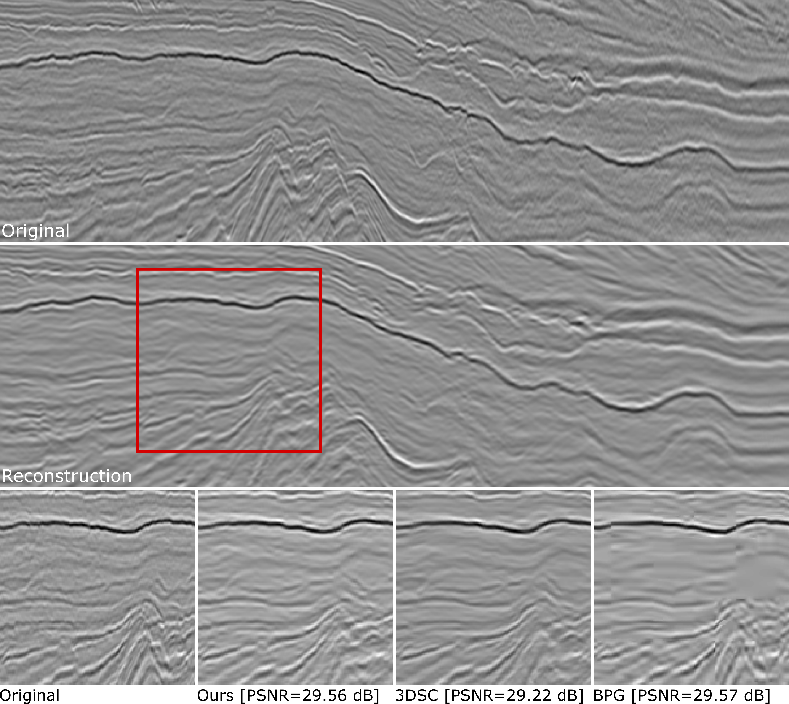

# 3DSC-GAN

TensorFlow Implementation for learned compression of 3-D poststack seismic data using Generative Adversarial Networks. The method was developed by Ribeiro et. al. in [Poststack Seismic Data Compression Using a Generative Adversarial Network](#).

-------------------------------------------------

## Data
The method was trained and tested using 3-D poststack seismic volumes from the Society of Exploration Geophysicists (SEG) Open Data repository. All the **original volumes** can be downloaded from this [link](http://www.gcg.ufjf.br/files/3dsc-gan/original_data.zip)

## Reconstruction Results
All the **reconstruction results** for the method and baselines can be downloaded from the links bellow:

| target bpv | Kahu3D | Opunake3D| Penobscot3D | Poseidon3D | Waihapa3D |
|------|------|------|------|------|------|
| 0.05 | [link](http://www.gcg.ufjf.br/files/3dsc-gan/Kahu3D_bpv_0.05.zip) | [link](http://www.gcg.ufjf.br/files/3dsc-gan/Opunake3D_bpv_0.05.zip) | [link](http://www.gcg.ufjf.br/files/3dsc-gan/Penobscot3D_bpv_0.05.zip) | [link](http://www.gcg.ufjf.br/files/3dsc-gan/Poseidon3D_bpv_0.05.zip) | [link](http://www.gcg.ufjf.br/files/3dsc-gan/Waihapa3D_bpv_0.05.zip) |
| 0.10 | [link](http://www.gcg.ufjf.br/files/3dsc-gan/Kahu3D_bpv_0.10.zip) | [link](http://www.gcg.ufjf.br/files/3dsc-gan/Opunake3D_bpv_0.10.zip) | [link](http://www.gcg.ufjf.br/files/3dsc-gan/Penobscot3D_bpv_0.10.zip) | [link](http://www.gcg.ufjf.br/files/3dsc-gan/Poseidon3D_bpv_0.10.zip) | [link](http://www.gcg.ufjf.br/files/3dsc-gan/Waihapa3D_bpv_0.10.zip) |
| 0.25 | [link](http://www.gcg.ufjf.br/files/3dsc-gan/Kahu3D_bpv_0.25.zip) | [link](http://www.gcg.ufjf.br/files/3dsc-gan/Opunake3D_bpv_0.25.zip) | [link](http://www.gcg.ufjf.br/files/3dsc-gan/Penobscot3D_bpv_0.25.zip) | [link](http://www.gcg.ufjf.br/files/3dsc-gan/Poseidon3D_bpv_0.25.zip) | [link](http://www.gcg.ufjf.br/files/3dsc-gan/Waihapa3D_bpv_0.25.zip) |
| 0.50 | [link](http://www.gcg.ufjf.br/files/3dsc-gan/Kahu3D_bpv_0.50.zip) | [link](http://www.gcg.ufjf.br/files/3dsc-gan/Opunake3D_bpv_0.50.zip) | [link](http://www.gcg.ufjf.br/files/3dsc-gan/Penobscot3D_bpv_0.50.zip) | [link](http://www.gcg.ufjf.br/files/3dsc-gan/Poseidon3D_bpv_0.50.zip) | [link](http://www.gcg.ufjf.br/files/3dsc-gan/Waihapa3D_bpv_0.50.zip) |
| 0.75 | [link](http://www.gcg.ufjf.br/files/3dsc-gan/Kahu3D_bpv_0.75.zip) | [link](http://www.gcg.ufjf.br/files/3dsc-gan/Opunake3D_bpv_0.75.zip) | [link](http://www.gcg.ufjf.br/files/3dsc-gan/Penobscot3D_bpv_0.75.zip) | [link](http://www.gcg.ufjf.br/files/3dsc-gan/Poseidon3D_bpv_0.75.zip) | [link](http://www.gcg.ufjf.br/files/3dsc-gan/Waihapa3D_bpv_0.75.zip) |
| 1.00 | [link](http://www.gcg.ufjf.br/files/3dsc-gan/Kahu3D_bpv_1.00.zip) | [link](http://www.gcg.ufjf.br/files/3dsc-gan/Opunake3D_bpv_1.00.zip) | [link](http://www.gcg.ufjf.br/files/3dsc-gan/Penobscot3D_bpv_1.00.zip) | [link](http://www.gcg.ufjf.br/files/3dsc-gan/Poseidon3D_bpv_1.00.zip) | [link](http://www.gcg.ufjf.br/files/3dsc-gan/Waihapa3D_bpv_1.00.zip) |

## Getting Started

### Installation

### 3DSC-GAN train/test

## Citation